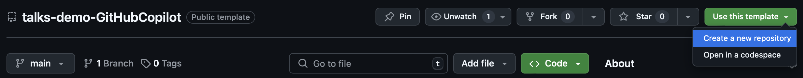
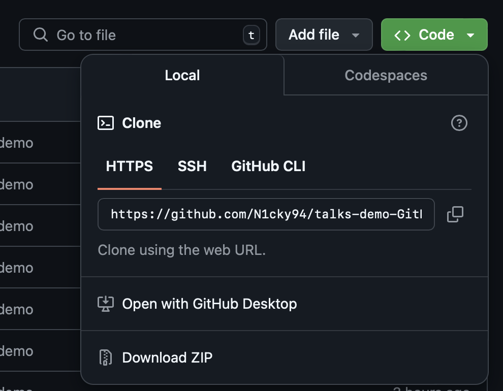

# The future of Pair Programming

>
> **Author**: Nick Bauters   
> **Talk**: [Future of Pair Programming](https://archilios.be/talks/future-of-pair-programming.pdf)   
> Lab / demo project   
> **Last update**: 10 september 2024   
> 

Hi there, and welcome to my repository on my Copilot talk.  
This demo is optimized for the use with IntelliJ IDEA.
This means that, using other tools might change how copilot works or reacts. 
Keep this in mind.

1. [Prerequisites](#prerequisites)
2. [Running the application](#running-the-app)
3. [Doing the Lab/Demo](#the-demo)

## Prerequisites

- Java SE 17+
- GitHub account
  - GitHub Copilot license
- IntelliJ Ultimate edition
  - GitHub Copilot plugin installed

## Running the App

### Step 1 - Getting the repository

Go to my repository [Talks > Demo > GitHub Copilot](https://github.com/N1cky94/talks-demo-GitHubCopilot)

This repository is a template repository, this means you can easily get a copy for your own account.
Press the `Use this template` Button and select `create a new repository`.
This will generate a new repository on your own account with all the files and structures in this repository.

You can easily make this a private repository for yourself. This will disable any Github Action scripts.
But the code should keep working.

### Step 2 - Getting the repository local

You might have another way of cloning repositories to your local system.
Feel free to follow your own way of working. For those who want some help:

1. Open a terminal or Command prompt
2. Navigate to the folder where you keep your projects
3. use the `git clone ` command with the link from your repository

There you go, it's downloading.  
When it is done, open this with IntelliJ and you are ready to go.

### Step 3 - Running the application

In IntelliJ, navigate to MainApp and press the run button.
You can also do this via run configurations.

And now it's up to you to do the Demo/Lab

## The demo / Lab

This demo/lab is a part of my talk `The future of Pair Programming`. 
You can find a rundown on the demo in the [Rundown file](./demo/rundown.md)
You will find all assignments right there.

Do you want to make it more challenging?
Go to the [tasks file](demo/tasks.md) instead of the rundown and try the refactors yourself.

Happy trying out!