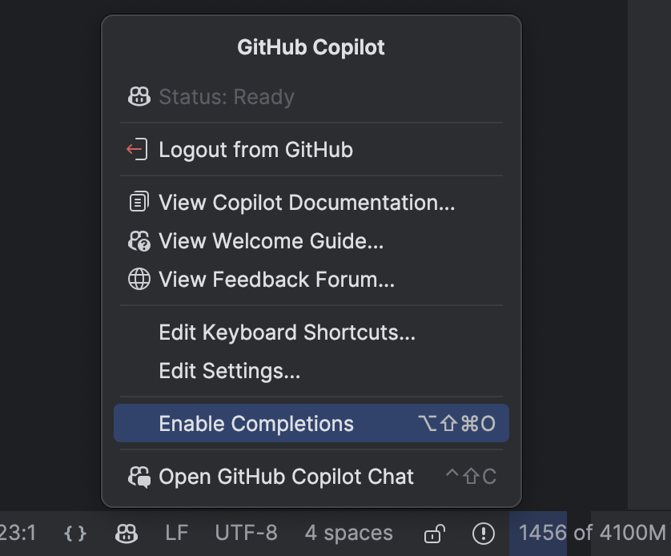
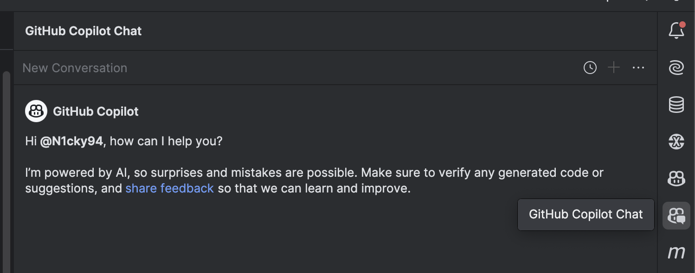

# Tasks set - Future of Pair Programming

This is more of a challenge lab than a guided lab. 
See if you can get the code better, without writing a single line of code yourself.
You are only allowed to write queries for GitHub Copilot, until you have the result you want.

Of course, copying and pasting is allowed.

1. [Explore Copilot in IntelliJ IDEA](#task-1---explore-github-copilot)
2. [Understand the code](#task-2---understand-the-code)
3. [Simple renaming](#task-3---renaming-a-class-and-a-variable)
4. [More complex refactors](#task-4---refactor-and-simplify)
5. [Test your code](#task-5---get-the-code-tested)
6. [Optimize the algorithm](#task-6---optimize-the-algorithm)

## Task 1 - Explore GitHub Copilot

Make sure the plugin for the chat and license are installed and activated.
Explore the features, even experiment with the inline generator for a second.
You can toggle everything via the GitHub Copilot menu at the bottom.

Also make sure to explore the GitHub Copilot Chat function, 
as we expect you to use the chat.

## Task 2 - Understand the code

Let Copilot explain you the code.

## Task 3 - Renaming a class and a variable

Using the guidelines in the docs folder, 
make sure Copilot regenerates better names for both 
the Algorithm class and its only field (`seed`).

## Task 4 - Refactor and simplify

Refactor the current code so it becomes more readable.
Copilot should use the [Style and Reference guide](../docs/StyleAndReferenceDecisions.md) 
from the docs folder, to do this refactor.
Make sure the refactors follow these guidelines.

Watch out, the code should work the same way.
Mind negative numbers.

## Task 5 - Get the code tested

Let Copilot create the needed tests.
And be mindful of how the code right now is written.

## Task 6 - Optimize the algorithm

Now query for other options for the algorithm, as we have chosen the least optimized version.
Let Copilot advise you and implement your choice.
Make sure all tests keep running!